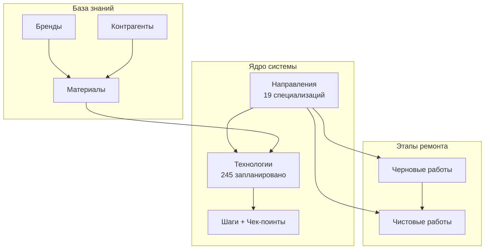
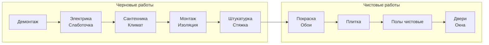

# Виртуальная Школа Ремонта

> Система стандартизации и обучения строительным работам

---

## Быстрая навигация

| | | |
|:---:|:---:|:---:|
| [[ПРОГРЕСС\|Прогресс]] | [[architecture\|Архитектура]] | [[ИДЕИ\|Идеи]] |

---

## Структура проекта

---

## 19 Направлений работ

### Подготовительные

| ID | Направление | Технологий | Статус |
|----|-------------|------------|--------|
| D00 | [[направления/культура-производства/D00-культура-производства\|Культура производства]] | 8 | draft |
| D01 | [[направления/демонтаж/D01-демонтаж\|Демонтаж]] | 12 | draft |

### Инженерные системы

| ID | Направление | Технологий | Статус |
|----|-------------|------------|--------|
| D02 | [[направления/электрика/D02-электрика\|Электрика]] | 22 | draft |
| D03 | [[направления/слаботочка/D03-слаботочка\|Слаботочные системы]] | 10 | draft |
| D04 | [[направления/сантехника/D04-сантехника\|Сантехника]] | 18 | draft |
| D05 | [[направления/климат/D05-климат\|Климат (HVAC)]] | 18 | draft |

### Строительные работы

| ID | Направление | Технологий | Статус |
|----|-------------|------------|--------|
| D06 | [[направления/монтаж/D06-монтаж\|Монтаж конструкций]] | 15 | draft |
| D07 | [[направления/изоляция/D07-изоляция\|Изоляция]] | 12 | draft |

### Отделка стен

| ID | Направление | Технологий | Статус |
|----|-------------|------------|--------|
| D08 | [[направления/подготовка-стен/D08-подготовка-стен\|Подготовка стен]] | 10 | draft |
| D09 | [[направления/штукатурка/D09-штукатурка\|Штукатурка]] | 15 | draft |
| D10 | [[направления/покраска/D10-покраска\|Покраска]] | 12 | draft |
| D11 | [[направления/обои/D11-обои\|Обои]] | 10 | draft |
| D12 | [[направления/плитка/D12-плитка\|Плитка]] | 18 | draft |

### Полы

| ID | Направление | Технологий | Статус |
|----|-------------|------------|--------|
| D13 | [[направления/полы-черновые/D13-полы-черновые\|Полы черновые]] | 15 | draft |
| D14 | [[направления/полы-чистовые/D14-полы-чистовые\|Полы чистовые]] | 18 | draft |

### Столярка и фасад

| ID | Направление | Технологий | Статус |
|----|-------------|------------|--------|
| D15 | [[направления/окна/D15-окна\|Окна]] | 8 | draft |
| D16 | [[направления/двери-межкомнатные/D16-двери-межкомнатные\|Двери межкомнатные]] | 10 | draft |
| D17 | [[направления/двери-входные/D17-двери-входные\|Двери входные]] | 6 | draft |
| D18 | [[направления/фасад/D18-фасад\|Фасад]] | 8 | draft |

---

## Порядок работ

---

## Статистика

| Метрика | Значение |
|---------|----------|
| Направлений | **19** |
| Технологий (план) | **245** |
| Технологий (создано) | **19** |
| Материалов баз | **19** |
| Брендов баз | **19** |

---

## База данных

### [[база-данных/материалы/материалы|Материалы]]

Справочники материалов по направлениям:
- [[база-данных/материалы/электрика/мат-электрика|Электрика]]
- [[база-данных/материалы/сантехника/мат-сантехника|Сантехника]]
- [[база-данных/материалы/климат/мат-климат|Климат]]
- [[база-данных/материалы/плитка/мат-плитка|Плитка]]
- ...и другие

### [[база-данных/бренды/бренды|Бренды]]

Рекомендованные производители по категориям

### [[база-данных/контрагенты/контрагенты|Контрагенты]]

Поставщики и подрядчики

---

## Этапы работ

| Этап | Описание | Ссылка |
|------|----------|--------|
| Черновые | Скрытые работы до отделки | [[этапы/черновые-работы]] |
| Чистовые | Финишная отделка | [[этапы/чистовые-работы]] |

---

## Технологии — примеры

| ID | Название | Направление |
|----|----------|-------------|
| T-PL-001 | [[технологии/плитка/T-PL-001-укладка-керамогранита-на-пол\|Укладка керамогранита на пол]] | Плитка |
| T-KL-001 | [[технологии/климат/T-KL-001-прокладка-трасс-кондиционера\|Прокладка трасс кондиционера]] | Климат |
| T-EL-001 | [[технологии/электрика/T-EL-001-штробление-штроборезом\|Штробление под проводку]] | Электрика |

Полный реестр: [[технологии/реестр-технологий|Реестр технологий]]

---

## Как использовать

1. **Открыть граф** (Ctrl/Cmd + G) — визуализация всех связей
2. **Поиск** (Ctrl/Cmd + O) — быстрый переход к файлу
3. **Backlinks** — в боковой панели видны все ссылки на текущий файл
4. **Теги** — файлы размечены по категориям через frontmatter

---

*Последнее обновление: 2025-11-29*
