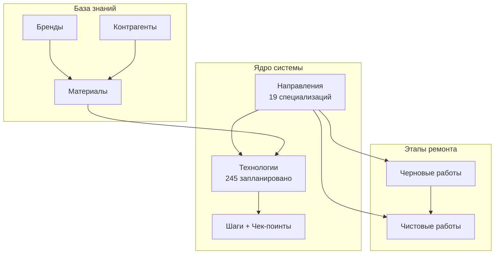
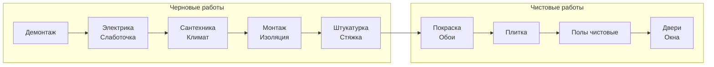

# Виртуальная Школа Ремонта

> Система стандартизации и обучения строительным работам

---

## Быстрая навигация

| | | |
|:---:|:---:|:---:|
| [[ПРОГРЕСС\|Прогресс]] | [[architecture\|Архитектура]] | [[ИДЕИ\|Идеи]] |

---

## Структура проекта

---

## 19 Направлений работ

### Подготовительные

| ID | Направление | Технологий | Статус |
|----|-------------|------------|--------|
| D00 | [[направления/культура-производства/_overview\|Культура производства]] | 8 | draft |
| D01 | [[направления/демонтаж/_overview\|Демонтаж]] | 12 | draft |

### Инженерные системы

| ID | Направление | Технологий | Статус |
|----|-------------|------------|--------|
| D02 | [[направления/электрика/_overview\|Электрика]] | 22 | draft |
| D03 | [[направления/слаботочка/_overview\|Слаботочные системы]] | 10 | draft |
| D04 | [[направления/сантехника/_overview\|Сантехника]] | 18 | draft |
| D05 | [[направления/климат/_overview\|Климат (HVAC)]] | 18 | draft |

### Строительные работы

| ID | Направление | Технологий | Статус |
|----|-------------|------------|--------|
| D06 | [[направления/монтаж/_overview\|Монтаж конструкций]] | 15 | draft |
| D07 | [[направления/изоляция/_overview\|Изоляция]] | 12 | draft |

### Отделка стен

| ID | Направление | Технологий | Статус |
|----|-------------|------------|--------|
| D08 | [[направления/подготовка-стен/_overview\|Подготовка стен]] | 10 | draft |
| D09 | [[направления/штукатурка/_overview\|Штукатурка]] | 15 | draft |
| D10 | [[направления/покраска/_overview\|Покраска]] | 12 | draft |
| D11 | [[направления/обои/_overview\|Обои]] | 10 | draft |
| D12 | [[направления/плитка/_overview\|Плитка]] | 18 | draft |

### Полы

| ID | Направление | Технологий | Статус |
|----|-------------|------------|--------|
| D13 | [[направления/полы-черновые/_overview\|Полы черновые]] | 15 | draft |
| D14 | [[направления/полы-чистовые/_overview\|Полы чистовые]] | 18 | draft |

### Столярка и фасад

| ID | Направление | Технологий | Статус |
|----|-------------|------------|--------|
| D15 | [[направления/окна/_overview\|Окна]] | 8 | draft |
| D16 | [[направления/двери-межкомнатные/_overview\|Двери межкомнатные]] | 10 | draft |
| D17 | [[направления/двери-входные/_overview\|Двери входные]] | 6 | draft |
| D18 | [[направления/фасад/_overview\|Фасад]] | 8 | draft |

---

## Порядок работ

---

## Статистика

| Метрика | Значение |
|---------|----------|
| Направлений | **19** |
| Технологий (план) | **245** |
| Технологий (создано) | **19** |
| Материалов баз | **19** |
| Брендов баз | **19** |

---

## База данных

### [[база-данных/материалы|Материалы]]

Справочники материалов по направлениям:
- [[база-данных/материалы/электрика/_overview|Электрика]]
- [[база-данных/материалы/сантехника/_overview|Сантехника]]
- [[база-данных/материалы/климат/_overview|Климат]]
- [[база-данных/материалы/плитка/_overview|Плитка]]
- ...и другие

### [[база-данных/бренды|Бренды]]

Рекомендованные производители по категориям

### [[база-данных/контрагенты|Контрагенты]]

Поставщики и подрядчики

---

## Этапы работ

| Этап | Описание | Ссылка |
|------|----------|--------|
| Черновые | Скрытые работы до отделки | [[этапы/черновые-работы]] |
| Чистовые | Финишная отделка | [[этапы/чистовые-работы]] |

---

## Технологии — примеры

| ID | Название | Направление |
|----|----------|-------------|
| T-PL-001 | [[технологии/плитка/T-PL-001-укладка-напольной-плитки\|Укладка напольной плитки]] | Плитка |
| T-KL-001 | [[технологии/климат/T-KL-001-прокладка-трасс-кондиционера\|Прокладка трасс кондиционера]] | Климат |
| T-EL-001 | [[технологии/электрика/T-EL-001-штробление-под-проводку\|Штробление под проводку]] | Электрика |

Полный реестр: [[технологии/_overview|Реестр технологий]]

---

## Как использовать

1. **Открыть граф** (Ctrl/Cmd + G) — визуализация всех связей
2. **Поиск** (Ctrl/Cmd + O) — быстрый переход к файлу
3. **Backlinks** — в боковой панели видны все ссылки на текущий файл
4. **Теги** — файлы размечены по категориям через frontmatter

---

*Последнее обновление: 2025-11-29*
