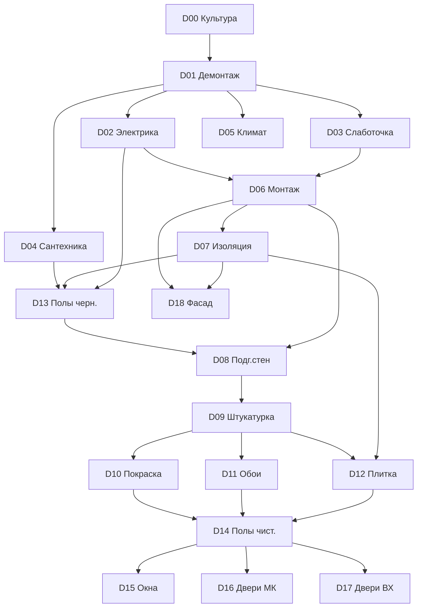

# Визуализация проекта

> Разные разрезы для понимания структуры и связей

---

## 1. Timeline ремонта (последовательность работ)

```
╔═══════════════════════════════════════════════════════════════════════════════╗
║                           ЭТАПЫ РЕМОНТА                                        ║
╠═══════════════════════════════════════════════════════════════════════════════╣
║                                                                                ║
║  ┌─────────────────────────────────────────────────────────────────────────┐  ║
║  │ D00 КУЛЬТУРА ПРОИЗВОДСТВА (на протяжении всего ремонта)                 │  ║
║  └─────────────────────────────────────────────────────────────────────────┘  ║
║                                                                                ║
║  ════════════════════════ ЧЕРНОВОЙ ЭТАП ═══════════════════════════════════   ║
║                                                                                ║
║  ┌──────────┐                                                                  ║
║  │ D01      │  ДЕМОНТАЖ                                                        ║
║  │ Демонтаж │  ────────────►                                                   ║
║  └──────────┘                                                                  ║
║       │                                                                        ║
║       ▼                                                                        ║
║  ┌──────────┬──────────┬──────────┬──────────┐                                ║
║  │ D02      │ D03      │ D04      │ D05      │  КОММУНИКАЦИИ                   ║
║  │Электрика │Слаботочка│Сантехника│ Климат   │  (параллельно)                  ║
║  └──────────┴──────────┴──────────┴──────────┘                                ║
║       │           │          │          │                                      ║
║       └───────────┴──────────┴──────────┘                                      ║
║                      │                                                         ║
║                      ▼                                                         ║
║  ┌──────────┬──────────┐                                                       ║
║  │ D06      │ D07      │  КОНСТРУКТИВ                                          ║
║  │ Монтаж   │Изоляция  │                                                       ║
║  └──────────┴──────────┘                                                       ║
║       │           │                                                            ║
║       └─────┬─────┘                                                            ║
║             ▼                                                                  ║
║  ┌──────────┐                                                                  ║
║  │ D13      │  ЧЕРНОВЫЕ ПОЛЫ                                                   ║
║  │Полы черн.│  (стяжка)                                                        ║
║  └──────────┘                                                                  ║
║       │                                                                        ║
║       ▼                                                                        ║
║  ┌──────────┬──────────┐                                                       ║
║  │ D08      │ D09      │  ПОДГОТОВКА СТЕН                                      ║
║  │Подг.стен │Штукатурка│                                                       ║
║  └──────────┴──────────┘                                                       ║
║                                                                                ║
║  ════════════════════════ ЧИСТОВОЙ ЭТАП ═══════════════════════════════════   ║
║                                                                                ║
║  ┌──────────┬──────────┬──────────┐                                           ║
║  │ D10      │ D11      │ D12      │  ФИНИШНАЯ ОТДЕЛКА                         ║
║  │ Покраска │  Обои    │ Плитка   │  (выбор по проекту)                       ║
║  └──────────┴──────────┴──────────┘                                           ║
║       │                                                                        ║
║       ▼                                                                        ║
║  ┌──────────┐                                                                  ║
║  │ D14      │  ЧИСТОВЫЕ ПОЛЫ                                                   ║
║  │Полы чист.│  (ламинат, паркет)                                               ║
║  └──────────┘                                                                  ║
║       │                                                                        ║
║       ▼                                                                        ║
║  ┌──────────┬──────────┬──────────┐                                           ║
║  │ D15      │ D16      │ D17      │  ДВЕРИ И ОКНА                              ║
║  │  Окна    │Двери МК  │Двери ВХ  │                                           ║
║  └──────────┴──────────┴──────────┘                                           ║
║       │                                                                        ║
║       ▼                                                                        ║
║  ┌──────────┐                                                                  ║
║  │ ЧИСТОВЫЕ │  Электрика, сантехника, климат                                   ║
║  │КОММУНИК. │  (розетки, смесители, сплит-системы)                            ║
║  └──────────┘                                                                  ║
║                                                                                ║
║  ════════════════════════ ФАСАД (отдельно) ════════════════════════════════   ║
║                                                                                ║
║  ┌──────────┐                                                                  ║
║  │ D18      │  ФАСАДНЫЕ РАБОТЫ                                                 ║
║  │  Фасад   │  (черновой + чистовой)                                          ║
║  └──────────┘                                                                  ║
║                                                                                ║
╚═══════════════════════════════════════════════════════════════════════════════╝
```

---

## 2. Граф зависимостей направлений

```
                              ┌─────────────────┐
                              │ D00 Культура    │
                              │ производства    │
                              └────────┬────────┘
                                       │ (всегда)
                                       ▼
                              ┌─────────────────┐
                              │  D01 Демонтаж   │
                              └────────┬────────┘
                                       │
           ┌───────────────────────────┼───────────────────────────┐
           │                           │                           │
           ▼                           ▼                           ▼
    ┌──────────────┐           ┌──────────────┐           ┌──────────────┐
    │D02 Электрика │◄─────────►│D03 Слаботочка│           │D04 Сантехника│
    └──────┬───────┘           └──────┬───────┘           └──────┬───────┘
           │                          │                          │
           │         ┌────────────────┴────────────────┐         │
           │         │                                 │         │
           │         ▼                                 ▼         │
           │  ┌──────────────┐                 ┌──────────────┐  │
           │  │ D05 Климат   │                 │ D06 Монтаж   │  │
           │  └──────┬───────┘                 └──────┬───────┘  │
           │         │                                │          │
           │         └────────────────┬───────────────┘          │
           │                          │                          │
           │                          ▼                          │
           │                  ┌──────────────┐                   │
           │                  │ D07 Изоляция │                   │
           │                  └──────┬───────┘                   │
           │                         │                           │
           └─────────────────────────┼───────────────────────────┘
                                     │
                                     ▼
                             ┌──────────────┐
                             │D13 Полы черн.│
                             └──────┬───────┘
                                    │
                    ┌───────────────┴───────────────┐
                    │                               │
                    ▼                               ▼
            ┌──────────────┐               ┌──────────────┐
            │D08 Подг.стен │               │D09 Штукатурка│
            └──────┬───────┘               └──────┬───────┘
                   │                              │
                   └──────────────┬───────────────┘
                                  │
                   ┌──────────────┼──────────────┐
                   │              │              │
                   ▼              ▼              ▼
           ┌──────────────┐ ┌──────────┐ ┌──────────────┐
           │D10 Покраска  │ │D11 Обои  │ │ D12 Плитка   │
           └──────┬───────┘ └────┬─────┘ └──────┬───────┘
                  │              │              │
                  └──────────────┼──────────────┘
                                 │
                                 ▼
                         ┌──────────────┐
                         │D14 Полы чист.│
                         └──────┬───────┘
                                │
                 ┌──────────────┼──────────────┐
                 │              │              │
                 ▼              ▼              ▼
         ┌──────────────┐ ┌──────────┐ ┌──────────────┐
         │  D15 Окна    │ │D16 Дв.МК │ │ D17 Дв.ВХ    │
         └──────────────┘ └──────────┘ └──────────────┘
```

---

## 3. Матрица: Направления × Этапы

| Направление | Блок | Черновая | Чистовая | Технологий |
|-------------|------|:--------:|:--------:|:----------:|
| D00 Культура производства | Системное | ✓ | ✓ | 1 |
| D01 Демонтаж | Подготовка | ✓ | - | 1 |
| D02 Электрика | Коммуникации | ✓ | ✓ | 1 |
| D03 Слаботочка | Коммуникации | ✓ | ✓ | 1 |
| D04 Сантехника | Коммуникации | ✓ | ✓ | 1 |
| D05 Климат | Коммуникации | ✓ | ✓ | 1 |
| D06 Монтаж | Конструктив | ✓ | ✓ | 1 |
| D07 Изоляция | Конструктив | ✓ | - | 1 |
| D08 Подготовка стен | Отделка | ✓ | - | 1 |
| D09 Штукатурка | Отделка | ✓ | - | 1 |
| D10 Покраска | Отделка | - | ✓ | 1 |
| D11 Обои | Отделка | - | ✓ | 1 |
| D12 Плитка | Отделка | - | ✓ | 1 |
| D13 Полы черновые | Полы | ✓ | - | 1 |
| D14 Полы чистовые | Полы | - | ✓ | 1 |
| D15 Окна | Двери/Окна | - | ✓ | 1 |
| D16 Двери межкомнатные | Двери/Окна | - | ✓ | 1 |
| D17 Двери входные | Двери/Окна | - | ✓ | 1 |
| D18 Фасад | Фасад | ✓ | ✓ | 1 |

---

## 4. Группировка по блокам

```
┌─────────────────────────────────────────────────────────────────────────────┐
│                              СИСТЕМНОЕ                                       │
│  ┌─────────────────────────────────────────────────────────────────────┐    │
│  │ D00 Культура производства                                           │    │
│  │ T-KP-001 Организация рабочего места                                 │    │
│  └─────────────────────────────────────────────────────────────────────┘    │
└─────────────────────────────────────────────────────────────────────────────┘

┌─────────────────────────────────────────────────────────────────────────────┐
│                             ПОДГОТОВКА                                       │
│  ┌─────────────────────────────────────────────────────────────────────┐    │
│  │ D01 Демонтаж                                                        │    │
│  │ T-DM-001 Демонтаж кирпичных перегородок                            │    │
│  └─────────────────────────────────────────────────────────────────────┘    │
└─────────────────────────────────────────────────────────────────────────────┘

┌─────────────────────────────────────────────────────────────────────────────┐
│                            КОММУНИКАЦИИ                                      │
│  ┌────────────────┐  ┌────────────────┐  ┌────────────────┐  ┌────────────┐ │
│  │ D02 Электрика  │  │ D03 Слаботочка │  │ D04 Сантехника │  │ D05 Климат │ │
│  │ T-EL-001       │  │ T-SL-001       │  │ T-SN-001       │  │ T-KL-001   │ │
│  │ Штробление     │  │ Прокладка UTP  │  │ Разводка ППР   │  │ Трассы     │ │
│  └────────────────┘  └────────────────┘  └────────────────┘  └────────────┘ │
└─────────────────────────────────────────────────────────────────────────────┘

┌─────────────────────────────────────────────────────────────────────────────┐
│                             КОНСТРУКТИВ                                      │
│  ┌─────────────────────────────────┐  ┌─────────────────────────────────┐   │
│  │ D06 Монтаж                      │  │ D07 Изоляция                    │   │
│  │ T-MN-001 Кладка газоблока       │  │ T-IZ-001 Звукоизоляция каркасом │   │
│  └─────────────────────────────────┘  └─────────────────────────────────┘   │
└─────────────────────────────────────────────────────────────────────────────┘

┌─────────────────────────────────────────────────────────────────────────────┐
│                               ПОЛЫ                                           │
│  ┌─────────────────────────────────┐  ┌─────────────────────────────────┐   │
│  │ D13 Полы черновые               │  │ D14 Полы чистовые               │   │
│  │ T-PC-040 Мокрая стяжка          │  │ T-PF-001 Укладка ламината       │   │
│  └─────────────────────────────────┘  └─────────────────────────────────┘   │
└─────────────────────────────────────────────────────────────────────────────┘

┌─────────────────────────────────────────────────────────────────────────────┐
│                              ОТДЕЛКА                                         │
│  ┌──────────────┐  ┌──────────────┐  ┌────────────┐  ┌────────┐  ┌────────┐ │
│  │D08 Подг.стен │  │D09 Штукатурка│  │D10 Покраска│  │D11 Обои│  │D12 Плит│ │
│  │ T-PD-001     │  │ T-SH-010     │  │ T-PK-001   │  │T-OB-010│  │T-PL-001│ │
│  │ Грунтовка    │  │ Уст.маяков   │  │ Валиком    │  │Флизелин│  │Керамогр│ │
│  └──────────────┘  └──────────────┘  └────────────┘  └────────┘  └────────┘ │
└─────────────────────────────────────────────────────────────────────────────┘

┌─────────────────────────────────────────────────────────────────────────────┐
│                           ДВЕРИ И ОКНА                                       │
│  ┌────────────────────┐  ┌────────────────────┐  ┌────────────────────┐     │
│  │ D15 Окна           │  │ D16 Двери межком.  │  │ D17 Двери входные  │     │
│  │ T-OK-001 ПВХ-окно  │  │ T-DI-001 Распашная │  │ T-DV-001 Металл.   │     │
│  └────────────────────┘  └────────────────────┘  └────────────────────┘     │
└─────────────────────────────────────────────────────────────────────────────┘

┌─────────────────────────────────────────────────────────────────────────────┐
│                               ФАСАД                                          │
│  ┌─────────────────────────────────────────────────────────────────────┐    │
│  │ D18 Фасад                                                           │    │
│  │ T-FS-001 Утепление пенополистиролом                                 │    │
│  └─────────────────────────────────────────────────────────────────────┘    │
└─────────────────────────────────────────────────────────────────────────────┘
```

---

## 5. Dashboard статистики

```
╔═════════════════════════════════════════════════════════════════════════════╗
║                        DASHBOARD ПРОЕКТА                                     ║
╠═════════════════════════════════════════════════════════════════════════════╣
║                                                                              ║
║  ┌────────────────────┐  ┌────────────────────┐  ┌────────────────────┐     ║
║  │   НАПРАВЛЕНИЯ      │  │    ТЕХНОЛОГИИ      │  │     МАТЕРИАЛЫ      │     ║
║  │                    │  │                    │  │                    │     ║
║  │   Всего: 19        │  │   Всего: 19        │  │   Всего: ?         │     ║
║  │   ████████████ 100%│  │   █░░░░░░░░░░░ 10% │  │   ░░░░░░░░░░░░ ?%  │     ║
║  │                    │  │                    │  │                    │     ║
║  │   Черновых: 11     │  │   Draft: 19        │  │   Заполнено: ?     │     ║
║  │   Чистовых: 12     │  │   Review: 0        │  │   Ожидает: ?       │     ║
║  │   Оба: 8           │  │   Approved: 0      │  │                    │     ║
║  └────────────────────┘  └────────────────────┘  └────────────────────┘     ║
║                                                                              ║
╠═════════════════════════════════════════════════════════════════════════════╣
║                          ПРОГРЕСС ПО БЛОКАМ                                  ║
╠═════════════════════════════════════════════════════════════════════════════╣
║                                                                              ║
║  Системное      [████████████████████] 100%  (1/1 технология)               ║
║  Подготовка     [████████████████████] 100%  (1/1)                          ║
║  Коммуникации   [█████░░░░░░░░░░░░░░░]  25%  (4/? технологий)               ║
║  Конструктив    [██████████░░░░░░░░░░]  50%  (2/?)                          ║
║  Полы           [██████████░░░░░░░░░░]  50%  (2/?)                          ║
║  Отделка        [████░░░░░░░░░░░░░░░░]  20%  (5/?)                          ║
║  Двери/Окна     [██████░░░░░░░░░░░░░░]  30%  (3/?)                          ║
║  Фасад          [██████████░░░░░░░░░░]  50%  (1/?)                          ║
║                                                                              ║
╠═════════════════════════════════════════════════════════════════════════════╣
║                        ПОСЛЕДНИЕ ТЕХНОЛОГИИ                                  ║
╠═════════════════════════════════════════════════════════════════════════════╣
║                                                                              ║
║  T-PL-001  Укладка керамогранита на пол      Плитка          draft          ║
║  T-EL-001  Штробление штроборезом            Электрика       draft          ║
║  T-SN-001  Разводка водоснабжения ППР        Сантехника      draft          ║
║  T-PC-040  Мокрая стяжка по маякам           Полы черновые   draft          ║
║  T-PK-001  Покраска стен валиком             Покраска        draft          ║
║                                                                              ║
╚═════════════════════════════════════════════════════════════════════════════╝
```

---

## 6. Карта связей "ДО / ПОСЛЕ"

| Направление | Что ПЕРЕД ним | Что ПОСЛЕ него |
|-------------|---------------|----------------|
| D00 Культура | - | Всё |
| D01 Демонтаж | D00 | D02-D07 |
| D02 Электрика | D01 | D06, D07, D08, D09 |
| D03 Слаботочка | D01 | D06, D07, D08, D09 |
| D04 Сантехника | D01 | D07, D12, D13 |
| D05 Климат | D01, D02 | D09, D10, D11 |
| D06 Монтаж | D02, D03 | D07, D08 |
| D07 Изоляция | D02-D06 | D08, D09, D12, D13 |
| D08 Подг.стен | D06, D07 | D09 |
| D09 Штукатурка | D08 | D10, D11, D12 |
| D10 Покраска | D09 | D14, D15, D16 |
| D11 Обои | D09 | D14, D15, D16 |
| D12 Плитка | D07, D09, D13 | D04(чист), D14 |
| D13 Полы черн. | D02, D04, D07 | D12, D14 |
| D14 Полы чист. | D10/D11/D12 | D15, D16, D17 |
| D15 Окна | D14 | - |
| D16 Двери МК | D14 | - |
| D17 Двери ВХ | D14 | - |
| D18 Фасад | D06, D07 | - |

---

## 7. Mermaid диаграммы (для рендеринга)

### Timeline (Gantt)

```mermaid
gantt
    title Этапы ремонта
    dateFormat  X
    axisFormat %s

    section Подготовка
    D01 Демонтаж           :d01, 0, 1

    section Коммуникации
    D02 Электрика черн.    :d02, after d01, 2
    D03 Слаботочка черн.   :d03, after d01, 2
    D04 Сантехника черн.   :d04, after d01, 2
    D05 Климат черн.       :d05, after d01, 2

    section Конструктив
    D06 Монтаж             :d06, after d02, 1
    D07 Изоляция           :d07, after d06, 1

    section Полы
    D13 Полы черновые      :d13, after d07, 2

    section Отделка черн.
    D08 Подготовка стен    :d08, after d13, 1
    D09 Штукатурка         :d09, after d08, 2

    section Отделка чист.
    D10 Покраска           :d10, after d09, 2
    D11 Обои               :d11, after d09, 2
    D12 Плитка             :d12, after d09, 3

    section Финиш
    D14 Полы чистовые      :d14, after d12, 2
    D15 Окна               :d15, after d14, 1
    D16 Двери МК           :d16, after d14, 1
    D17 Двери ВХ           :d17, after d14, 1
```



### Граф зависимостей (Flowchart)



---

## Как использовать

1. **Для планирования** — Timeline показывает порядок работ
2. **Для понимания зависимостей** — Граф и таблица ДО/ПОСЛЕ
3. **Для отслеживания прогресса** — Dashboard и матрица
4. **Для презентации** — Mermaid диаграммы (рендерятся в GitHub, Obsidian, Notion)
